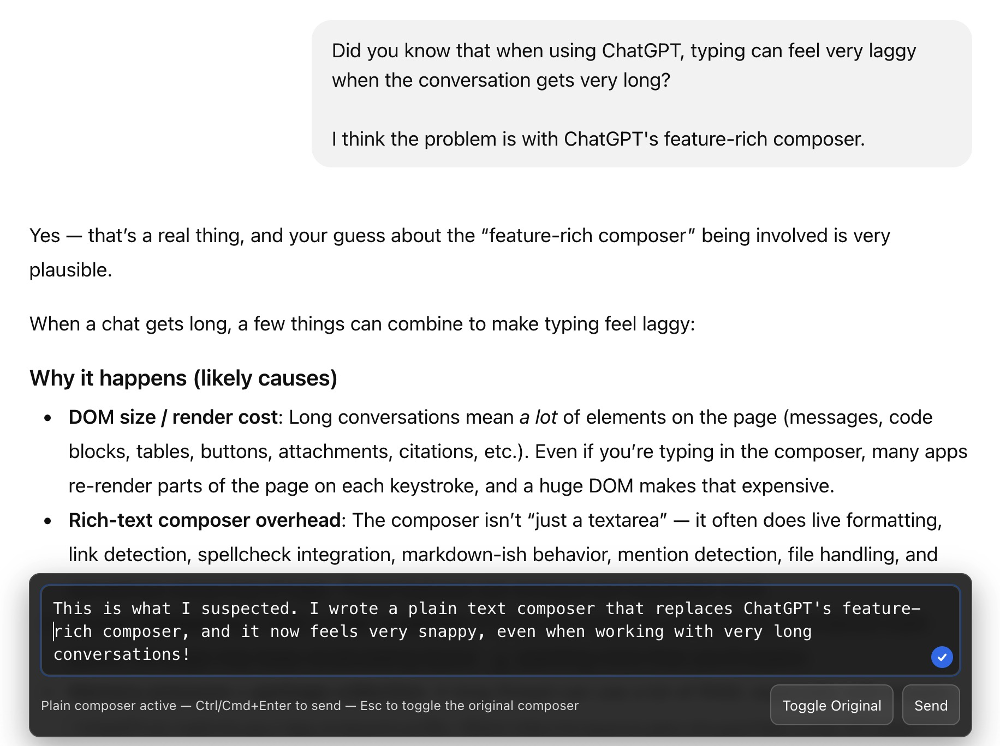

# ChatGPT Plain Text Composer (userscript)

A lightweight userscript for **ChatGPT (chat.openai.com / chatgpt.com)** that replaces the native rich composer with a **plain `<textarea>` overlay** for **smooth, lag-free typing** — especially in *very long chats* where the default composer can become slow.

---

## Why this exists

ChatGPT’s built-in composer is feature-rich (attachments, voice, formatting, smart UI behaviors) and tightly integrated with the app UI.

In long conversations, however, many users experience **typing lag**, such as:

- input latency (characters appear late)
- dropped keystrokes
- sluggish cursor movement
- occasional freezes while the UI rerenders

This usually happens because the native composer is not a simple `<textarea>`: it is a rich editor that is deeply coupled to the page’s state, layout, and React rendering pipeline.

---

## What this script does

This userscript injects a **minimal plain text composer overlay** that:

✅ feels like typing into a classic text area  
✅ avoids the heavy rich editor DOM and rerender overhead  
✅ still sends messages through ChatGPT normally  
✅ supports multiline prompts naturally  
✅ supports autogrow (optional, configurable)  
✅ saves drafts (per chat URL)  
✅ includes a toggle to temporarily show the original composer  
✅ remains properly aligned with the central ChatGPT chat column (sidebar-aware)

---

## Screenshot / Demo

---

## Features

- **Plain textarea overlay** for fast input
- **Enter inserts a newline**
- **Ctrl/Cmd + Enter to send**
- **Autogrow** (up to a percentage of viewport height)
- **Per-chat drafts** stored in `localStorage`
- **Draft cleanup** with TTL + maximum entries
- **Esc** toggles the original ChatGPT composer
- **Ctrl+`** transfers focus to the plain composer
- **Toggle Original** button + optional floating return button
- **Stable anchoring**
  - centered to the ChatGPT conversation column
  - sidebar-aware layout handling
- **Throttled MutationObserver** for SPA rerenders

---

## Installation

### 1) Install a userscript manager
- Chrome / Chromium: **ViolentMonkey**
- Firefox: **ViolentMonkey**
- (Other managers may work too.)

### 2) Install the script
1. Open the ViolentMonkey dashboard
2. Click **New Script**
3. Paste the content of `chatgpt-plain-composer.user.js`
4. Save

### 3) Open ChatGPT
Go to:
- https://chat.openai.com  
or
- https://chatgpt.com

The plain composer should appear automatically and replace the original composer.

---

## Usage

### Typing
- Type normally in the overlay textarea.
- Drafts are saved automatically (per chat URL).

### Sending
- **Ctrl+Enter** (Windows/Linux) or **Cmd+Enter** (macOS)
- Or click **Send**

### Toggling the original composer
- Press **Esc**, or click **Toggle Original**
- When the original composer is visible, use the overlay’s toggle again (or the floating return button, if enabled) to return.

---

## How it works (high level)

ChatGPT’s native composer remains in the DOM, but the script:

1. Locates the native prompt editor (`contenteditable` / ProseMirror-based composer)
2. Hides the native editor (default)
3. Injects a plain `<textarea>` overlay with a minimal UI
4. Keeps the overlay aligned to the same horizontal region as the chat column, accounting for the sidebar layout
5. On send, copies the overlay text into the native composer and triggers a send using a sequence of strategies:
   - dispatch `input` / `paste` events where possible
   - simulate send hotkeys (Ctrl/Cmd+Enter)
   - click the send button (fallback)

To preserve line breaks, the script inserts text in a way that keeps newlines intact when transferring to the native composer.

---

## Privacy

- Drafts are stored in **your browser’s `localStorage`**, on your machine only.
- This script does **not** transmit any data anywhere.

---

## Configuration

Most settings can be tweaked inside the script in the `CONFIG` object:

- fixed width / height (or autogrow parameters)
- draft persistence (TTL, max entries, debounce timings)
- mutation observer throttling
- send strategy preferences
- styling (dark theme, font, padding)

---

## Compatibility

### Userscript managers
This script is a standard userscript and does not rely on special APIs (`@grant none`), so it should work in most common managers:

- ✅ ViolentMonkey (tested)
- ✅ Tampermonkey (expected to work)
- ✅ Greasemonkey (expected to work on Firefox)

### ChatGPT
ChatGPT is a single-page app (SPA) with frequent DOM updates.  
The script uses a MutationObserver + periodic checks to reattach after rerenders.

Because ChatGPT’s input is a rich editor, some browsers/userscript managers may handle synthetic keyboard/input events differently. The script includes multiple strategies to maximize reliability.

---

## Known limitations

- This is a **plain text** composer: no attachments, no rich formatting tools in the overlay.
- If ChatGPT changes their DOM structure or editor implementation, the script may require updates.
- Some environments may block synthetic keyboard events; the script uses fallbacks, but edge cases are possible.

---

## Troubleshooting

### The overlay does not show up
- Make sure the script is enabled in your userscript manager.
- Hard refresh ChatGPT (**Ctrl+Shift+R** / **Cmd+Shift+R**).
- Open DevTools → Console and look for logs starting with:
  - `[PlainComposer]` (or whatever prefix your script uses)

### Sending doesn’t work
ChatGPT UI variants differ slightly (editor changes, button labels, A/B experiments).  
If sending fails, adjust the send strategy options in the script, or temporarily toggle back to the original composer.

---

## Uninstall

1. Disable or remove the script in your userscript manager.
2. (Optional) Clear saved drafts from `localStorage`:
   - search for keys starting with `vm_plain_composer_draft:` (or your script’s draft prefix).

---

## Contributing

PRs and improvements are welcome!

If ChatGPT changes their DOM and the script breaks, please open an issue and include:

- browser + version
- userscript manager + version
- whether sending works via hotkey vs send button
- console logs starting with your script prefix
- (optional) HTML snippet around the composer area (`form[data-type="unified-composer"]`, etc.)

---

## License

This project is licensed under the MIT License. See the [LICENSE](LICENSE) file for details.
